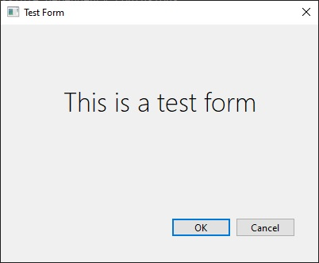

# QT Form Load Test
## Extremely basic example of QT form load from Python script

Design forms in QT Designer and load from a Python script

https://www.qt.io/

<hr>

Open a command prompt and `cd` to a new directory of your choosing:

(optional; recommended) Create a virtual environment with:
```
python -m venv "venv"
venv\Scripts\activate
```

To install do:
```
git clone https://github.com/vluz/QTLoadTest.git
cd QTLoadTest
pip install -r requirements.txt
```

To run do:<br>
`python formload.py`

<hr>

Output:       


